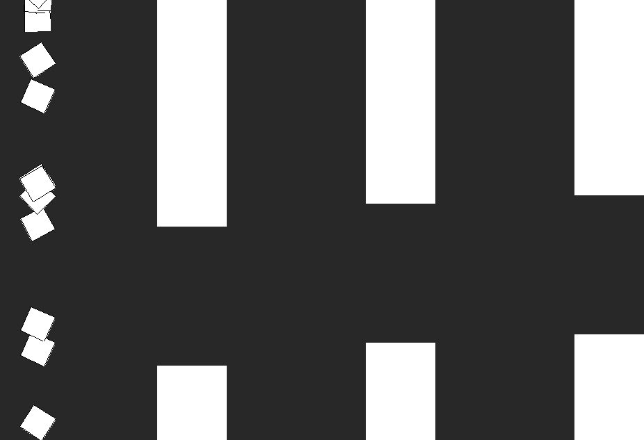

# Flappy Bird with a Neural Network(In my case it is more like a Flappy Square))
### I wanted to understand how NN actually work (as for now I am mostly working with python), and this guy explains it amazingly good in these playlist of videos [video](https://www.youtube.com/watch?v=XJ7HLz9VYz0&list=PLRqwX-V7Uu6aCibgK1PTWWu9by6XFdCfh).
### So I quickly wrote a simple clone of Flappy Bird, and then spent like 3-4 days slowly and steadily following the totorial trying to digest as much info as I could, and only a bit ambiguous thing is backpropagation, so I will experiment with it for a little bit longer, (then I will try doing the same but for snake, with convolutional nn)

# (PS Press: M - to load already trained bird, S - To save your best bird)